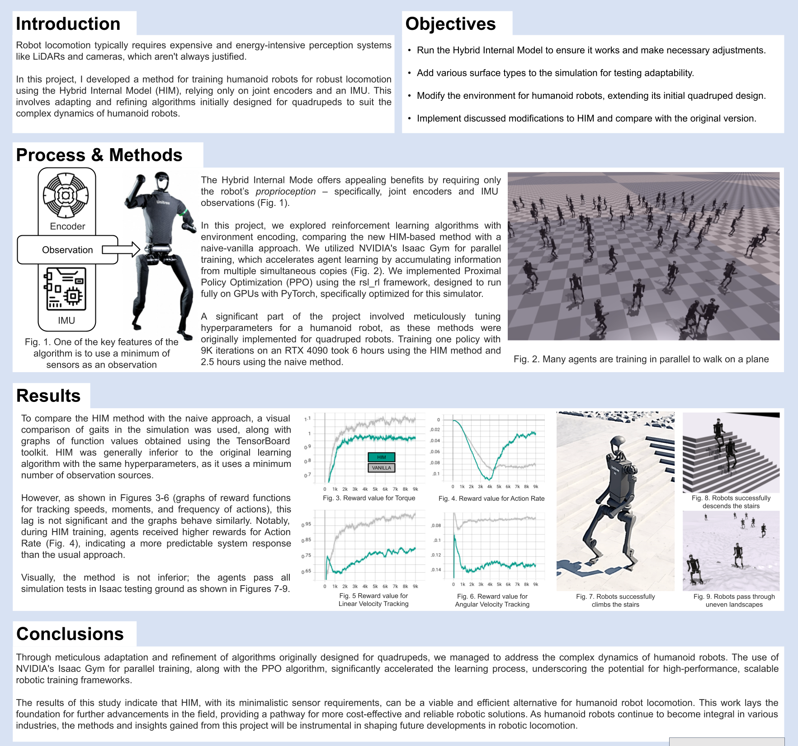
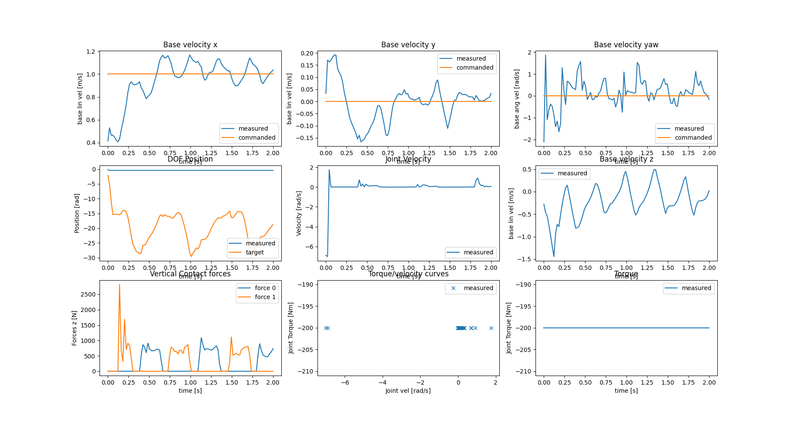

## Demo

We test our codes under the following environment:

- Ubuntu 20.04
- NVIDIA Driver: 525.147.05
- CUDA 12.0
- Python 3.7.16
- PyTorch 1.10.0+cu113
- Isaac Gym: Preview 4

1. Create an environment and install PyTorch:

  - `conda create -n himloco python=3.7.16`
  - `conda activate himloco`
  - `pip3 install torch==1.10.0+cu113 torchvision==0.11.1+cu113 torchaudio==0.10.0+cu113 -f https://download.pytorch.org/whl/cu113/torch_stable.html`

2. Install Isaac Gym:
  - Download and install Isaac Gym Preview 4 from https://developer.nvidia.com/isaac-gym
  - `cd isaacgym/python && pip install -e .`

3. Clone this repository.

  - `git clone https://github.com/dancher00/him-humanoid-h1.git`
  - `cd him-humanoid-h1`

4. Install HIMLoco.
  - `cd rsl_rl && pip install -e .`
  - `cd ../legged_gym && pip install -e .`

**Note:** Please use legged_gym and rsl_rl provided in this repo, we have modefications on these repos.

### Tutorial

1. Train a policy:

  - `cd legged_gym/legged_gym/scripts`
  - `python train.py --task=h1`

2. Play and export the latest policy:
  - `cd legged_gym/legged_gym/scripts`
  - `python play.py --task=h1`
